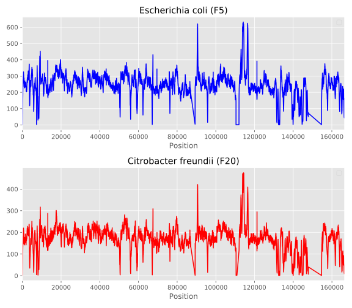
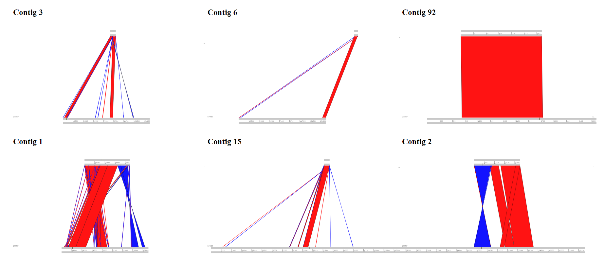
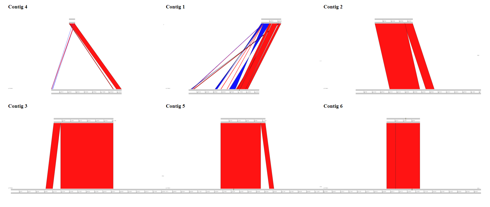
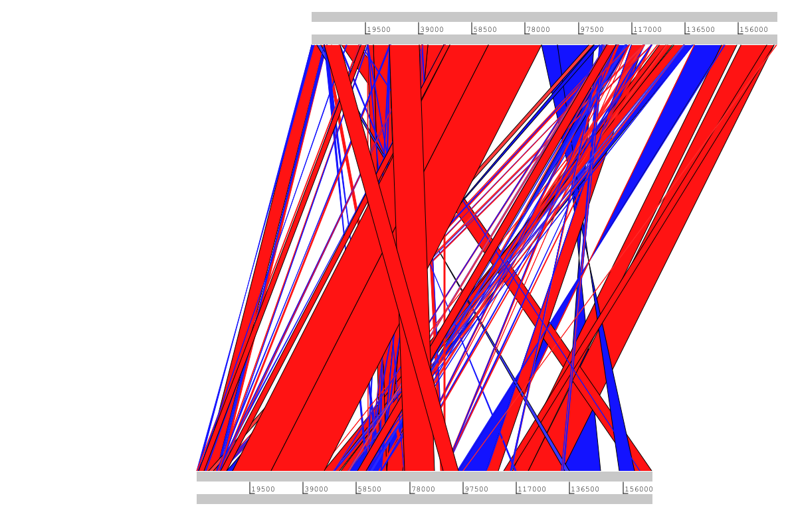
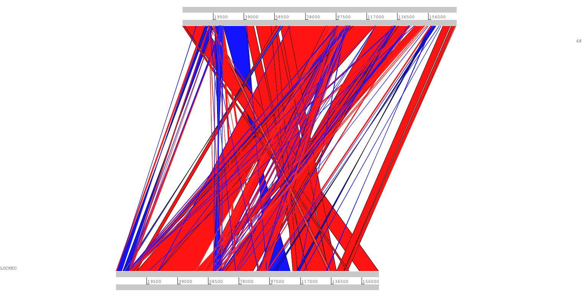

## Results
We have **343434** reads in the sample taken from *Escherichia coli* and *251128* reads for *Citrobacter freundii*. If you compare each library in proportion to the total number of bases, you will see that *Escherichia coli* library has more nucleotides and more reads.

  -----------------------------------------------------------------------------
  File Name                     Number of Reads         Number of Bases
  ----------------------------- ----------------------- -----------------------
  1-F5-96\_S1\_L001\_R1\_001    171717                  38124416

  1-F5-96\_S1\_L001\_R2\_001    171717                  38253111

  4-F20-96\_S2\_L001\_R1\_001   125564                  27633180

  4-F20-96\_S2\_L001\_R2\_001   125564                  27727284
  -----------------------------------------------------------------------------

## Raw Data Statistics

After trimming, we get 4 different outputs for each library. For each one of them, we have forward and reverse reads. For those reads, we have paired and unpaired reads.

For *Escherichia coli* library, `trimmomatic` drops **443** reads for forward strand and drops **8394** reads for reverse strand. If we look at *Citrobacter freundii*, **321** reads are dropped by `trimmomatic` for forward strand and **5926** reads are dropped for reverse strand. You can see the detail numbers in the table below.

  ----------------------------------------------------------------------------------
  File Name                    F5 Reads          F20 Reads         F20/F5
  ---------------------------- ----------------- ----------------- -----------------
  forward\_paired              163188            119552            73.26%

  forward\_unpaired            8086              5691              70.37%

  forward dropped              **443**           **321**           **72.26%**

  reverse\_paired              163188            119552            73.26%

  reverse\_unpaired            135               86                63.31%

  reverse dropped              **8394**          **5926**          **70.59%**

  Total Reads After Trimming   334597            244881            73.19%

  Total Reads                  343434            251128            73.12%
  ----------------------------------------------------------------------------------

## Number of NCBI RefSeq Records

The summary of the results is listed in the below table. We put a threshold for the mapping reads number which is `1000`[. We use this number because we want to clear results. The threshold can be changed from the person who wants to follow this protocol. Also, we decided that at least half of the reference genome should be covered by our reads. Hence, the threshold for the breadth of coverage is ]{.title-ref}[50%]{.title-ref}\`.

  ------------------------------------------------------------------------------------------------------------
  Library                        Plasmids with \>1K Mapping Reads   Plasmids where Breadth of Coverage \>50%
  ------------------------------ ---------------------------------- ------------------------------------------
  *Escherichia coli* (F5)        173                                45

  *Citrobacter freundii* (F20)   135                                36
  ------------------------------------------------------------------------------------------------------------

## Coverage Statistics

These results can be interpreted wrongly, because we do not know the answers to the following questions:

1.  Are the mapped reads separated in the plasmid?
2.  Are the reads only mapped to particular regions of the reference plasmid?

The breadth of coverage results give us the answers of questions listed above. The following table shows the plasmids in the database with higher breadth of coverage.

  --------------------------------------------------------------------------------
  Library                        Accession               Breadth of Coverage (%)
  ------------------------------ ----------------------- -------------------------
  *Escherichia coli* (F5)        NC\_025175.1            90.2%

  *Escherichia coli* (F5)        NC\_024956.1            88.3%

  *Escherichia coli* (F5)        NC\_025139.1            79.7%

  *Citrobacter freundii* (F20)   NC\_019049.1            77.7%

  *Escherichia coli* (F5)        NC\_004998.1            60.2%
  --------------------------------------------------------------------------------

## Top 5 Best Candidates

We choose the plasmid with higher breadth of coverage (`NC_025175.1`) for further study. We also included in this study the plasmid `NC_025138.1`, that was suggested by one of the authors of the original paper, who also isolated the samples we study.

We find the number of mapping reads using `samtools view -F 4` command. As you can see in the table below, more reads map to the plasmid `NC_025175.1` than to `NC_025138.1`, in both libraries. The difference between the number of mapping reads is **243443** for *Escherichia coli* (F5) and **165817** for *Citrobacter freundii* (F20).

  -------------------------------------------------------------------------------------------------------------------------------
  Library                        Accession         Number of Mapping Reads   Total Reads After Trimming/Number of Mapping Reads
  ------------------------------ ----------------- ------------------------- ----------------------------------------------------
  *Escherichia coli* (F5)        NC\_025175.1      277167                    82.84%

  *Escherichia coli* (F5)        NC\_025138.1      33724                     10.08%

  *Citrobacter freundii* (F20)   NC\_025175.1      187823                    76.70%

  *Citrobacter freundii* (F20)   NC\_025138.1      22006                     8.99%
  -------------------------------------------------------------------------------------------------------------------------------

## Number of Mapping Reads with Best Candidates

After choosing the best candidate, we want see the depth of coverage for each position.

{.align-centeralign-center}

In the below table, we introduced the exact positions that are not covered from our reads.

  -------------------------------------------------------------------------------
  Library                        Position Start   Position End    End-Start
  ------------------------------ ---------------- --------------- ---------------
  *Escherichia coli* (F5)        8061             8417            356

  *Escherichia coli* (F5)        87006            89274           2268

  *Escherichia coli* (F5)        110447           111986          1539

  *Escherichia coli* (F5)        132435           132485          50

  *Escherichia coli* (F5)        132738           132968          230

  *Escherichia coli* (F5)        147876           154647          6771

  *Citrobacter freundii* (F20)   8062             8417            355

  *Citrobacter freundii* (F20)   87006            89274           2268

  *Citrobacter freundii* (F20)   110447           110885          438

  *Citrobacter freundii* (F20)   110903           111987          1084

  *Citrobacter freundii* (F20)   132738           132896          158

  *Citrobacter freundii* (F20)   132922           132964          42

  *Citrobacter freundii* (F20)   139942           139959          17

  *Citrobacter freundii* (F20)   144620           144652          32

  *Citrobacter freundii* (F20)   147876           154650          6774
  -------------------------------------------------------------------------------

## Positions With 0 Depth For NC\_025175.1

Also, some genes that are not covered by our reads. In the following table, you can see which genes that are not covered by our reads. The most significant genes are *Beta-lactamase* for both libraries. Because of this gene, bacterial organisms have shown resistance to the antibiotics. For library *Citrobacter freundii* (F20), *Mercuric resistance operon coregulator, MerD* gene is the most important one. This gene has shown resistance to the *Mercury* element (Hg). It can be useful for the bioremediation of contaminated environments.

  -------------------------------------------------------------------------------------------------------
  Library                        Strand   Locus Tag        Product
  ------------------------------ -------- ---------------- ----------------------------------------------
  Both                           (-)      D616\_p149014    hypothetical protein

  Both                           (+)      D616\_p149136    IS629 transposase

  Both                           (+)      D616\_p149137    Mobile element protein

  Both                           (+)      D616\_p149138    hypothetical protein

  Both                           (+)      D616\_p149139    Retron-type RNA-directed DNA polymerase

  Both                           (-)      D616\_p149173    AroG

  Both                           (-)      D616\_p149174    hypothetical protein

  Both                           (-)      D616\_p149207    hypothetical protein

  *Citrobacter freundii* (F20)   (-)      D616\_p149217    Relaxase /helicase

  *Citrobacter freundii* (F20)   (+)      D616\_p149224    Mercuric resistance operon coregulator, MerD

  Both                           (+)      D616\_p149228    TniB NTP-binding protein

  Both                           (+)      D616\_p149229    hypothetical protein

  Both                           (-)      D616\_p149230    macrolide 2-phosphotransferase, mph(B)

  Both                           (-)      D616\_p149231    hydrolase, alpha/beta fold family

  Both                           (-)      D616\_p149232    Transcriptional regulator, TetR family

  Both                           (-)      D616\_p149233    hypothetical protein

  Both                           (-)      D616\_p149234    Beta-lactamase

  Both                           (+)      D616\_p149235    hypothetical protein

  Both                           (-)      D616\_p149236    GGDEF family protein

  Both                           (+)      D616\_p149237    TniB NTP-binding protein
  -------------------------------------------------------------------------------------------------------

## Genes That Are Not Covered From Our Reads

This figure contains the biggest contigs for *Escherichia coli* (F5) library that we get after the assembly process with SPAdes. The important deduction we make is that *Contig2* has insertion.

{.align-centeralign-center}

The figure below belongs to *Citrobacter freundii* (F20) library. The *Contig2, Contig3 and, Contig5* have the deletion.

{.align-centeralign-center}

We did the first assembly with *Phrap* and we used the only mapped reads with reference plasmid. After the assembly process, we get *545 contigs* for library *Escherichia coli* (F5) and *590 contigs* for library *Citrobacter freundii* (F20). After that, we decide to extend our contigs using the unmapped reads with reference plasmid. As a result, we get fewer contigs.

  -------------------------------------------------------------------------------------------------------------------------
  Library                        Assembly Tool     Number Of Contigs   N50      Number of Highly Similar Contigs   N50
  ------------------------------ ----------------- ------------------- -------- ---------------------------------- --------
  *Escherichia coli* (F5)        Phrap             545                 2318     520                                2318

  *Citrobacter freundii* (F20)   Phrap             590                 2071     538                                2071

  *Escherichia coli* (F5)        SPAdes            3815                1028     13                                 86647

  *Citrobacter freundii* (F20)   SPAdes            3704                1040     25                                 15692
  -------------------------------------------------------------------------------------------------------------------------

## Contigs Statistics for NC\_025175.1

After scaffolding contigs, we visualize the both libraries plasmid genome in *Artemis Comparasion Tool*.

{.align-centeralign-center}

{.align-centeralign-center}
