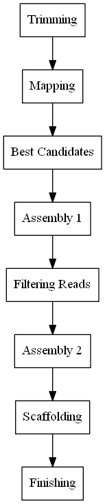

====
Data
====
• We have two libraries which are called F5 and F20, or we can say that *Escherichia coli* and *Citrobacter freundii*, respectively. For each library, we have forward reads and reverse reads. Also, the original file names are available from the list below. 

1. 1-F5-96_S1_L001_R1_001.fastq.gz  > Library **F5**, *Forward Reads*
2. 1-F5-96_S1_L001_R2_001.fastq.gz  > Library **F5**, *Reverse Reads*
3. 4-F20-96_S2_L001_R1_001.fastq.gz > Library **F20**, *Forward Reads*
4. 4-F20-96_S2_L001_R2_001.fastq.gz > Library **F20**, *Reverse Reads*

• In this study, we aim to find original plasmid that matches with our reads in the *RefSeq database*. Reference records can be obtained from `RefSeq Database`_ with given file names listed below.

.. _RefSeq Database: https://ftp.ncbi.nlm.nih.gov/refseq/release/plasmid

• The name of the files are:

1. plasmid.1.1.genomic.fna.gz
2. plasmid.2.1.genomic.fna.gz
3. plasmid.3.1.genomic.fna.gz
4. plasmid.4.1.genomic.fna.gz
5. plasmid.5.1.genomic.fna.gz

=========
Protocols
=========

• You can see the workflow for bacterial genome assembly used in this study from the given figure below.

• Trimming adaptors from both 5' and 3' ends of your sequences are the most crucial step for the genome assembly process. Also, getting rid of low-quality reads improves the standard of your analyzes. We used ``trimmomatic`` as a trimming tool and we performed this process by using the following bash code.

.. code-block:: bash
   :lineos:

   java -jar trimmomatic-0.36.jar PE -phred33 [Forward fastq file] [Reverse fastq file] \
   [Forward paired output] [Forward unpaired output] [Reverse paired output] [Reverse unpaired output] \
   ILLUMINACLIP:<fastaWithAdaptersEtc>:<seed mismatches>:<palindrome clip threshold>:<simple clip threshold> \ 
   LEADING:<quality> TRAILING:<quality> SLIDINGWINDOW:<windowSize>:<requiredQuality> MINLEN:<length>

• You can see from the above code, ``trimmomatic`` is a java based application. In the first line, we used ``java -jar trimmomatic-0.36.jar`` command to run the tool. ``PE`` parameter refers to paired-end data as an input. ``-phred33`` parameter is the quality type of your sequences, it can be changed for different quality types such as ``-phred64``. As a read input, we used our raw fastq files. In the second line, you can specify the output names. In the following line, ``ILLUMINACLIP`` parameter takes four input. With ``<fastaWithAdaptersEtc>``, you can choose a fasta file containing all adaptors and PCR sequences, etc. We used ``TruSeq3-PE.fa`` file for this option. ``<seed mismatches>`` option, allows us to choose the maximum mismatch count which will still allow a full match to be performed. We used ``2`` for this option. ``<palindrome clip threshold>`` specifies how accurate the match between the two 'adapter ligated' reads. We used ``30`` for this option. With ``<simple clip threshold>``, you can specify how accurate the match between any adapter etc. We used ``10`` for this option. In the last line, ``LEADING`` parameter allow us to specify the minimum quality required to keep a base. We used ``3`` for this option. ``TRAILING`` parameter acts as same with the previous one. We used ``3`` for this option. ``SLIDINGWINDOW`` parameter takes two inputs. With ``<windowSize>`` option, you can specify the number of bases to average across. With ``<requiredQuality>`` option, you can specify the average quality required. We used ``4 and 15`` for this option. ``MINLEN`` parameter allows us to specify the minimum length of reads to be kept. We used ``36`` for this option.
 
-------
Mapping
-------

• After obtaining "**Next Generation Sequencing**" (a.k.a NGS) reads, the following step of many *NGS* analyzes is the read mapping or the alignment of the reads with references. Hence, we compared each library with references by using Burrows-Wheeler Aligner alignment tool. This tool contains different aligners with different algorithms. Two of them are ``Bwa-mem`` and ``Bwa-aln``. We used both of them and analyzed the results.

^^^^^^^
Bwa-mem
^^^^^^^

• The following *bash* code gives us the result of the alignment which contains the references if the mapped reads more than 1000 only. In the first line, the aligner creates an index for the alignment. ``-p`` parameter provides to entitle of output database. In the second line, bwa carry out the alignment process with ``mem`` algorithm and creates an output in **Sequence Alignment Map** (a.k.a *SAM*) format. ``-o`` parameter indicates the output file. In the third line, samtools sort the sam file and convert it to a bam file. ``-O`` parameter indicates the type of the output file. In the following line, samtools indexing the bam file. In the last line, idxstats gives us statistics about the results. It is a *TAB-delimited* file and each line consisting of *reference sequence name*, *sequence length*, *mapped reads number*, *unmapped reads number*. Therefore, we use awk command to select the third column which means *mapped reads number* and we filtered with a given threshold. After that, we sorted the output with sort command where ``N`` in ``-kN`` is the number of the key, and ``n`` means sort numeric. 

.. code-block:: bash
   :linenos:

   bwa index -p [Database name] [Reference_file_path]
   bwa mem [Database name] [Forward fastq file] [Reverse fastq file] -o [Output file].sam
   samtools sort -O BAM -o [Output file].bam [Output file].sam
   samtools index [Output file].bam
   samtools idxstats [Output file].bam |awk '$3>1000'|sort -k3n > [Output file].stats

^^^^^^^
Bwa-aln
^^^^^^^

• Using ``bwa-aln`` more or less is the same with ``bwa-mem`` except minor differences. As is seen in the previous explanation, the differences occur in the second, third, fourth and fifth lines. In the second line of code, we took up the database and we carried out the alignment process with our reads. The output is a ``sai`` file which is produced by ``bwa-aln``. In the third line, we follow the same idea for reverse reads. In the following line, ``sampe`` sub-command allow us to create a sam file with combining forward reads and reverse reads alignment. In the fifth line, we used ``samtools`` with ``view`` sub-command, ``-bS`` parameter allows us to create bam file from the sam file where ``-b`` parameter for the type of output file and ``-S`` parameter for ignoring compatibility for previous versions of ``samtools``.

.. code-block:: bash
   :linenos:

   bwa index -p [Database name] [Reference_file_path]
   bwa aln [Database name] [Forward fastq file] > [Forward Output].sai
   bwa aln [Database name] [Reverse fastq file] > [Reverse Output].sai
   bwa sampe [Database name] [Forward Output].sai [Reverse Output].sai [Forward fastq file] [Reverse fastq file] > [Output file].sam
   samtools view -bS [Output file].sam > [Output file].bam
   samtools sort -O bam -o [Sorted output file].bam  [Output file].bam
   samtools index [Sorted output file].bam
   samtools idxstats [Sorted output file].bam |awk '$3>1000'|sort -k3n > [Output file].stats

---------------------------
Finding Breadth of Coverage
---------------------------

• In order to determine the most appropriate references, we should know the breadth of coverage of each reference. For this purpose, we used ``bedtools`` with ``genomeCoverageBed`` sub-command. ``genomeCoverageBed`` computes a histogram of coverage with a given genome. In the first line of code, we took the ``samtools idxstats`` output and select the column one and two. As we mentioned previously, ``idxstats`` output contains *reference sequence name*, *sequence length*, *mapped reads number*, *unmapped reads number*, respectively. We need only first and second column for the make ``genomeCoverageBed`` work. In the second line, ``-ibam`` parameter allows us to use bam file as an input. With ``-g`` parameter, the tool will report the depth of coverage at each base on each reference in the genome file. If we look at the output file, we can see that each line consisting of *reference sequence name*, *depth of coverage*, *number of bases with given depth*, *length of the reference* and *fraction of bases on reference with given depth*, respectively. In the third line, thanks to the ``awk`` command, we can calculate the breadth of coverage, easily.

.. warning::

   • **0** depth means unmapped regions occur in reference. We must pay attention, if we want the calculate the breadth of coverage, properly.

• We can say that the breadth of coverage can be calculated with ``1-$5`` if the second column equals *0* which means that summary of fraction of all depth, but 0.

.. note::

   • ``0.2>$5`` this condition allow us to choose references with higher coverage.

• In the following lines, we combine the results in one file with ``cat`` command and we sort the file numerically.  
   
.. code-block:: bash
   :linenos:

   samtools idxstats [Output file].bam |awk -v OFS='\t' '{print $1, $2}' > [Output file].txt
   genomeCoverageBed -ibam [Output file].bam -g [Output file].txt > [Coverage output file].txt
   awk -v OFS='\t' '$2==0 && 0.2>$5 {print $1,1-$5}' [Coverage output file].txt > [Coverage summary output file].txt
   cat [Coverage summary output file].txt > [All coverage summary file].txt
   sort -k2nr [All coverage summary file].txt > [Sorted all coverage summary file].txt

^^^^^^^^^^^^^^^^^^^^^^^^^^^^^^^^^^^
Aligning Reads with Best Candidates
^^^^^^^^^^^^^^^^^^^^^^^^^^^^^^^^^^^
• We determine the two most likely references. We choose one of them according to the breadth of coverage results. The other one is suggested to us from the owner of the reads. You can access the references with accession number `NC_025175.1`_ and `NC_025138.1`_, respectively.

.. _NC_025175.1: https://www.ncbi.nlm.nih.gov/nuccore/NC_025175.1
.. _NC_025138.1: https://www.ncbi.nlm.nih.gov/nuccore/NC_025138.1

-------------------------
Libraries-Best candidates
-------------------------

• After choosing the references, we want to see which reads in our files mapped with the references. If we can filter the reads, we will have a better chance to follow out assembly process. In the first line, ``bwa`` creates an index for the reference file. In the second line, the alignment process occurs and ``-R`` parameter allows us to configure the header line of the output ``sam`` file. In the following line, ``fixmate`` sub-command provides to fill in mate coordinates from a name sorted alignment. In the last line, ``fixmate`` output sorted with ``sort`` sub-command.  

.. code-block:: bash
   :linenos:

   bwa index [Reference plasmid].fasta
   bwa mem -R '@RG\tID:foo\tSM:bar\tLB:library1' [Reference plasmid].fasta [Forward fastq file] [Reverse fastq file] > [Output file].sam
   samtools fixmate -O bam [Output file].sam [Fixmate output file].bam
   samtools sort -O bam -o [Sorted fixmate output file].bam [Fixmate output file].bam

^^^^^^^^^^^^^^^^^^^^^^^^^^^^^^^^^^^^^^^^^^^^^^^^^^^^^^^^^^^^^^^^^^^^^^^
Creating new fastq files contain only mapped reads with best candidates
^^^^^^^^^^^^^^^^^^^^^^^^^^^^^^^^^^^^^^^^^^^^^^^^^^^^^^^^^^^^^^^^^^^^^^^

• Getting read id's for creating new fastq files for NC_025138.1

.. code:: bash
	
	samtools view F5-NC_025138.1fixmatesorted.bam |cut -f 1|uniq |head -300000|sort -u > F5-NC_025138.1fastqid.txt
	samtools view F20-NC_025138.1fixmatesorted.bam |cut -f 1|uniq |head -205000|sort -u > F20-NC_025138.1fastqid.txt

• Getting read id's for creating new fastq files for NC_025175.1

.. code:: bash

	samtools view F5-NC_025175.1fixmatesorted.bam |cut -f 1|uniq |head -200000|sort -u > F5-NC_025175.1fastqid.txt
	samtools view F20-NC_025175.1fixmatesorted.bam |cut -f 1|uniq |head -200000|sort -u > F20-NC_025175.1fastqid.txt

---------------------------------------------
Creating new fastq files with given read id's
---------------------------------------------

• This python script creates new fastq files with given forward read id's.

.. code-block:: python
   :linenos:

   from Bio import SeqIO

   input_file = "{Forward fastq file}"
   id_file = "{Library}-{plasmid accession}fastqid.txt"
   output_file = "{Library}-{plasmid accession}.fastq"
   wanted = set(line.rstrip("\n").split(None, 1)[0] for line in open(id_file))
   print("Found %i unique identifiers in %s" % (len(wanted), id_file))
   records = (r for r in SeqIO.parse(input_file, "fastq") if r.id in wanted)
   count = SeqIO.write(records, output_file, "fastq")
   print("Saved %i records from %s to %s" % (count, input_file, output_file))
   if count < len(wanted):
       print("Warning %i IDs not found in %s" % (len(wanted) - count, input_file))

• This python script creates new fastq files with given reverse read id's.

.. code-block:: python
   :linenos:
   
   from Bio import SeqIO

   input_file = "{Reverse fastq file}"
   id_file = "{Library}-{plasmid accession}fastqid.txt"
   output_file = "{Library}-{plasmid accession}.fastq"
   wanted = set(line.rstrip("\n").split(None, 1)[0] for line in open(id_file))
   print("Found %i unique identifiers in %s" % (len(wanted), id_file))
   records = (r for r in SeqIO.parse(input_file, "fastq") if r.id in wanted)
   count = SeqIO.write(records, output_file, "fastq")
   print("Saved %i records from %s to %s" % (count, input_file, output_file))
   if count < len(wanted):
       print("Warning %i IDs not found in %s" % (len(wanted) - count, input_file))

^^^^^^^^^^^^^^^^^^^^^^
Assembly with Geneious
^^^^^^^^^^^^^^^^^^^^^^

• After creating new fastq files, we should do assembly. You can do assembly easily with following geneious de novo assembly tutorial. You can access the tutorial here `De novo Assembly Tutorial`_.

.. _De novo Assembly Tutorial: https://www.geneious.com/tutorials/de-novo-assembly/

^^^^^^^^^^^^^^^^^^^^^^^^^^^^^^^^^^
Filtering reads with given contigs
^^^^^^^^^^^^^^^^^^^^^^^^^^^^^^^^^^

• After the assembly process we have ace files for each contig. Some regions in the contigs have lower depth for reference bases. We do not want those reads and we should delete them. The following python script will do the work.

.. code-block:: python
   :linenos:

   import sys
   from Bio.Sequencing import Ace
   from Bio import SeqIO
   import numpy as np

   if len(sys.argv)<4:
       print(sys.argv[0],"not enough arguments")
       print("Usage:", sys.argv[0],"ACE input.fastq output.fastq")
       exit(1)

   cmd_name = sys.argv.pop(0)
   input_file = sys.argv.pop(0)
   output_file = sys.argv.pop(0)

   def parse_af(ace_file):
       ans = {}
   for line in open(ace_file):
       if line.startswith("AF"):
           _, read_id, _, pos = line.strip().split()
           ans[read_id]=int(pos)
   return(ans)

   bad_reads = set()

   for ace_file in sys.argv:
       assembly = Ace.read(open(ace_file))
       contig = assembly.contigs[0]
  	   print("%s: %d reads" % (ace_file, contig.nreads))
   if len(contig.af)==0:
       af = parse_af(ace_file)
       all_reads = [(contig.reads[i].rd.name,
        			af[contig.reads[i].rd.name],
        			contig.reads[i].rd.padded_bases) for i in range(contig.nreads)]
   else:
       all_reads = [(contig.reads[i].rd.name,
        			contig.af[i].padded_start,
        			contig.reads[i].rd.padded_bases) for i in range(contig.nreads)]

   depth = np.zeros(contig.nbases+1, dtype=int)

   for name, start, length in all_reads:
       for j in range(start, start + length):
           depth[j] +=1

   bad_places = (depth < (depth.mean()-3*depth.std())) | (depth>= (depth.mean()+3*depth.std()))

   for name, start, length in all_reads:
       bad_bp_in_read = np.sum(bad_places[start:(start+length)])
       if bad_bp_in_read > length/5: # if over 20% of bp are "bad"...
           bad_reads.add(name[:name.index("_")]) # then remember the fragment name

   print("Now filtering %d bad fragments" % (len(bad_reads)))
   records = [r for r in SeqIO.parse(input_file, "fastq") if r.id not in bad_reads]
   count = SeqIO.write(records, output_file, "fastq")
   print("Saved %i records from %s to %s" % (count, input_file, output_file))

^^^^^^^^^^^^^^^^^^^^^^^^^^^^
Assembly with filtered reads
^^^^^^^^^^^^^^^^^^^^^^^^^^^^

• For NC_025138.1

.. code:: bash

	## Trimming
	
	sickle pe -f R1-filtered.fastq -r R2-filtered.fastq -t sanger -o R1-filtered-trimmed.fastq -p R2-filtered-trimmed.fastq -s singles.fastq -q 30 -l 45
	
	## Assembly
	
	### Spades
	
	spades.py --careful -o SPAdes_out -1 R1-filtered-trimmed.fastq -2 R2-filtered-trimmed.fastq -s singles.fastq
	
	### Abyss 
	
	abyss-pe  k=31 name=Kmer31 in='/home/fustunel/Plasmid/geneious-2019-02-21/Sickle-2019-03-19/F20-NC_025138.1/R1-filtered-trimmed.fastq /home/fustunel/Plasmid/geneious-2019-02-21/Sickle-2019-03-19/F20-NC_025138.1/R2-filtered-trimmed.fastq' se='/home/fustunel/Plasmid/geneious-2019-02-21/Sickle-2019-03-19/F20-NC_025138.1/singles.fastq'
	
	## Statistics
	
	quast.py SPAdes_out/scaffolds.fasta -o quast-SPAdes
	quast.py /home/fustunel/Plasmid/geneious-2019-02-21/Abyss-2019-03-19/F20-NC_025138.1/Kmer31-scaffolds.fa -o quast-Abyss

• We can generalize the code like this;

.. code:: bash

	## Trimming
	
	sickle pe -f R1-filtered.fastq -r R2-filtered.fastq -t sanger -o R1-filtered-trimmed.fastq -p R2-filtered-trimmed.fastq -s singles.fastq -q 30 -l 45
	
	## Assembly
	
	### Spades
	
	spades.py --careful -o SPAdes_out -1 $plasmid folder path/R1-filtered-trimmed.fastq -2 $plasmid folder path/R2-filtered-trimmed.fastq -s singles.fastq
	
	### Abyss 
	
	abyss-pe  k=31 name=Kmer31 in='$plasmid folder path/R1-filtered-trimmed.fastq $plasmid folder path/R2-filtered-trimmed.fastq' se='$plasmid folder path/singles.fastq'
	
	## Statistics
	
	quast.py SPAdes_out/scaffolds.fasta -o quast-SPAdes
	quast.py Kmer31-scaffolds.fa -o quast-Abyss

