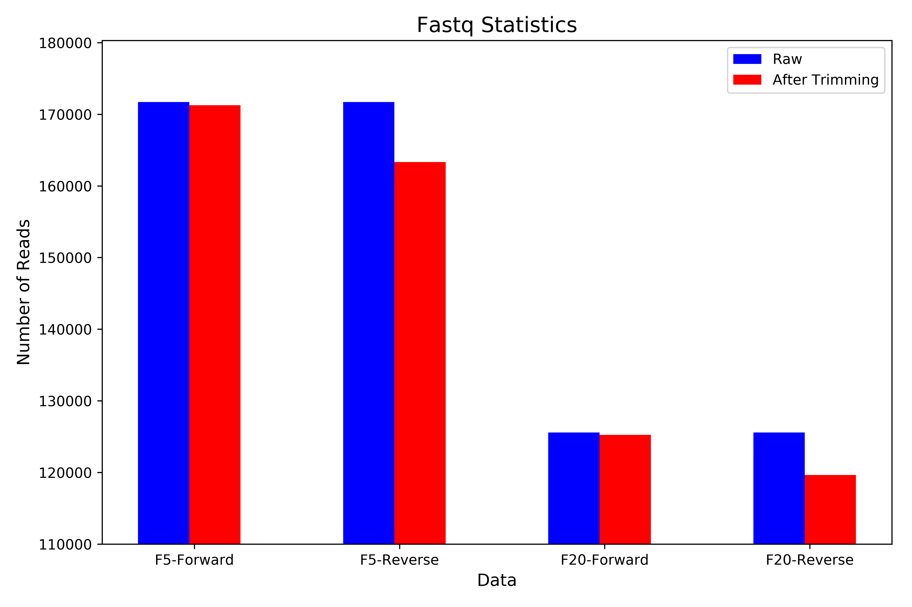

=======
Results
=======

As you can see in the table below, we have **343434** reads in the sample taken from *Escherichia coli* and *251128* reads for *Citrobacter freundii*. If you  compare each library in proportion to the total number of bases, you will see that *Escherichia coli* library has more nucleotides and more reads.

.. list-table:: Raw Data Statistics
   :widths: 25 25 25
   :header-rows: 1
   :align: left

   * - File Name
     - Number of Reads
     - Number of Bases
   * - 1-F5-96_S1_L001_R1_001
     - 171717
     - 38124416
   * - 1-F5-96_S1_L001_R2_001
     - 171717
     - 38253111
   * - 4-F20-96_S2_L001_R1_001
     - 125564
     - 27633180
   * - 4-F20-96_S2_L001_R2_001
     - 125564
     - 27727284


After trimming, we get 4 different outputs for each library. For each one of them, we have forward and reverse reads. For those reads, we have paired and unpaired reads. 

For *Escherichia coli* library, ``trimmomatic`` drops **443** reads for forward strand and drops **8394** reads for reverse strand. If we look at *Citrobacter freundii*, **321** reads are dropped by ``trimmomatic`` for forward strand and **5926** reads are dropped for reverse strand. You can see the detail numbers in the table below.


.. list-table:: Statistics After Trimming
   :widths: 25 25 25 25
   :header-rows: 1
   :align: left

   * - File Name
     - F5 Reads
     - F20 Reads
     - F20/F5
   * - forward_paired
     - 163188
     - 119552
     - 73.26%
   * - forward_unpaired
     - 8086
     - 5691
     - 70.37%
   * - forward dropped
     - **443**
     - **321**
     - **72.26%**
   * - reverse_paired
     - 163188
     - 119552
     - 73.26%
   * - reverse_unpaired
     - 135
     - 86
     - 63.31%
   * - reverse dropped
     - **8394**
     - **5926**
     - **70.59%**
   * - Total Reads After Trimming
     - 334597
     - 244881
     - 73.19%
   * - Total Reads
     - 343434
     - 251128
     - 73.12%
  


Also, you can see the comparasion of the raw reads and the trimmed reads in the histogram below.




.. subfigstart::

.. _fig-F5-raw-qual:

.. figure:: _static/F5-raw-qual.png
    :alt: F5 raw reads quality
    :width: 90%
    :align: center
    
    F5 raw reads quality


.. _fig-F5-trimmed-qual:

.. figure:: _static/F5-trimmed-qual.png
    :alt: F5 trimmed reads quality
    :width: 90%
    :align: center
    
    F5 trimmed reads quality


.. _fig-F20-raw-qual:

.. figure:: _static/F20-raw-qual.png
    :alt: F20 raw reads quality
    :width: 90%
    :align: center
    
    F20 raw reads quality


.. _fig-F20-trimmed-qual:

.. figure:: _static/F20-trimmed-qual.png
    :alt: F20 trimmed reads quality
    :width: 90%
    :align: center
    
    F20 trimmed reads quality

.. subfigend::
    :width: 0.30
    :alt: FastQC Quality Plots
    :label: FastQC Per Base Sequence Quality Comparasion
    

We aligned our reads with ``NCBI RefSeq Database`` plasmids. You can see in the table below the total number of records of ``NCBI RefSeq Database`` are **15076**.

.. list-table:: Number of NCBI RefSeq Records
   :widths: 25 25 
   :header-rows: 1
   :align: left

   * - File Name
     - Number of Recors
   * - plasmid.1.1.genomic.fna
     - 4597
   * - plasmid.2.1.genomic.fna
     - 3234
   * - plasmid.3.1.genomic.fna
     - 2524
   * - plasmid.4.1.genomic.fna
     - 3023
   * - plasmid.5.1.genomic.fna
     - 1698
   * - Total
     - 15076


The summary of the results is listed in the below table. We put a threshold for the mapping reads number which is ``1000```. We use this number because we want to clear results. The threshold can be changed from the person who wants to follow this protocol. Also, we decided that at least half of the reference genome should be covered by our reads. Hence, the threshold for the breadth of coverage is ``50%``.

.. list-table:: Coverage Statistics
   :widths: 25 25 25
   :header-rows: 1
   :align: left

   * - Library
     - Plasmids with >1K Mapping Reads
     - Plasmids where Breadth of Coverage >50%
   * - *Escherichia coli* (F5)
     - 173
     - 45
   * - *Citrobacter freundii* (F20)
     - 135    
     - 36 

These results can be interpreted wrongly, because we do not know the answers to the following questions:

1. Are the mapped reads separated in the  plasmid? 
2. Are the reads only mapped to particular regions of the reference plasmid?

The breadth of coverage results give us the answers of questions listed above. The following table shows the plasmids in the database with higher breadth of coverage.

.. list-table:: Top 5 Best Candidates
   :widths: 25 25 25
   :header-rows: 1
   :align: left

   * - Library
     - Accession
     - Breadth of Coverage (%)
   * - *Escherichia coli* (F5)
     - NC_025175.1  
     - 90.2%
   * - *Escherichia coli* (F5)
     - NC_024956.1  
     - 88.3%
   * - *Escherichia coli* (F5)
     - NC_025139.1  
     - 79.7%
   * - *Citrobacter freundii* (F20)
     - NC_019049.1  
     - 77.7%
   * - *Escherichia coli* (F5)
     - NC_004998.1  
     - 60.2%
      
We choose the plasmid with higher breadth of coverage (``NC_025175.1``) for further study. We also included in this study the plasmid ``NC_025138.1``, that was suggested by one of the authors of the original paper, who also isolated the samples we study.

We find the number of mapping reads using ``samtools view -F 4`` command. As you can see in the table below, more reads map to the plasmid ``NC_025175.1``  than to ``NC_025138.1``, in both libraries. The difference between the number of mapping reads is **243443** for *Escherichia coli* (F5) and **165817** for *Citrobacter freundii* (F20).

.. list-table:: Number of Mapping Reads with Best Candidates
   :widths: 25 25 25 25
   :header-rows: 1
   :align: left

   * - Library
     - Accession
     - Number of Mapping Reads
     - Total Reads After Trimming/Number of Mapping Reads
   * - *Escherichia coli* (F5)
     - NC_025175.1  
     - 277167
     - 82.84%
   * - *Escherichia coli* (F5)
     - NC_025138.1  
     - 33724
     - 10.08%
   * - *Citrobacter freundii* (F20)
     - NC_025175.1  
     - 187823
     - 76.70%
   * - *Citrobacter freundii* (F20)
     - NC_025138.1  
     - 22006
     - 8.99%
  


  
